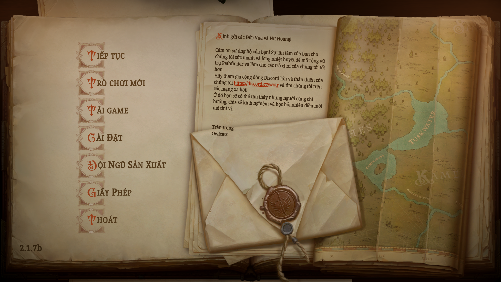

# FontMod — Pathfinder: Kingmaker (bản Việt hóa)

Mod đổi font cho **Pathfinder: Kingmaker**, mở rộng để hiển thị **đầy đủ tiếng Việt**.
Fork từ [thehambeard/FontMod](https://github.com/thehambeard/FontMod) (mod gốc hỗ trợ Wrath of the Righteous, Kingmaker & Rogue Trader) — **bản fork này đã rút gọn, CHỈ còn Kingmaker** (đây mới là bản dùng FreeType dựng atlas SDF phủ tiếng Việt).

- **Phiên bản:** 1.1.3
- **Tác giả:** Hambeard (gốc), Fanha Giang (bản Việt hóa)
- **Repo:** https://github.com/fanha99/FontMod
- **Yêu cầu:** [Unity Mod Manager](https://www.nexusmods.com/site/mods/21) (UMM)

---

## Có gì khác bản gốc

- **Phủ đủ tiếng Việt:** charset mở rộng U+1EA0–U+1EF9 + dấu kết hợp. Mod **dựng atlas SDF từ TTF ngay lúc game chạy** bằng FreeType native (`TMPro_Plugin.dll`) — không cần Unity Editor.
- **Cấu hình build theo từng font** qua `fontBuild.json` (kiểu chữ, cỡ, độ đậm SDF, faux-bold riêng mỗi font).
- **Cache atlas:** lần đầu render rồi lưu `AtlasCache\.atlas`, lần sau nạp thẳng → khởi động nhanh.
- **Atlas-only (mới ở 1.1.3):** dùng được atlas **dù không có file `.ttf`** trong `Fonts\`. Atlas là ảnh SDF đã render (không phải font software) nên **an toàn bản quyền hơn** khi phát hành lại các font không được phép redistribute.
- **Font mặc định:** [Noto Serif](https://fonts.google.com/noto/specimen/Noto+Serif) (giấy phép OFL, đính kèm `Fonts\NotoSerif-OFL.txt`).

## Cài đặt

1. Cài Unity Mod Manager cho Pathfinder: Kingmaker.
2. Tải file `FontMod.zip` ở mục [Releases](https://github.com/fanha99/FontMod/releases).
3. Dùng UMM (tab *Mods* → kéo-thả zip) **hoặc** giải nén thủ công vào:
   `(thư mục cài Kingmaker)\Mods\` — sao cho có `Mods\FontMod\Info.json`.
4. Chạy game, nhấn **Ctrl+F10** mở UMM, bật **FontMod**.

## Sử dụng

- Bỏ thêm font vào `Mods\FontMod\Fonts\` (hoặc chỉ bỏ `AtlasCache\.atlas` nếu dùng atlas-only).
- **Ctrl+F10** mở menu UMM để đổi ánh xạ font.
- Ánh xạ **default** đổi TẤT CẢ font trong game trừ khi đặt riêng. Đây là font đầu tiên được nạp ở lần chạy đầu nếu chưa có `fontMappings.json`.
- Nút **M** cạnh font game: ánh xạ một font đã cài vào nó. **I**: bỏ qua. **X**: xóa ánh xạ.
- Sau khi ánh xạ, font cập nhật ở lần scene kế tiếp.
- Tên font game mới gặp được ghi vào `encounteredFonts.json` — tự ánh xạ tùy ý.

### File cấu hình (trong `Mods\FontMod\`)

| File | Vai trò |
|------|---------|
| `fontMappings.json` | Ánh xạ *font game → font thay*. Phải ở dạng mảng cặp `Key`/`Value`. |
| `fontBuild.json` | Thiết lập build per-font (`Style`, `SizeReduction`, `StyleMod`, `BoldWeight`, `NormalWeight`). |
| `Fonts\*.ttf` | Font nguồn. |
| `AtlasCache\*.atlas` | Atlas đã dựng (tự sinh, hoặc ship sẵn cho atlas-only). |

> Chi tiết kỹ thuật (charset, cơ chế cỡ chữ/độ đậm, tool pre-build, build lại DLL): xem [`HUONG_DAN_VN.md`](HUONG_DAN_VN.md).

## Build & phát hành (cho dev)

Mã nguồn nay **chỉ còn 1 project Kingmaker** (`FontMod-KM.csproj`) — đã bỏ các nhánh Wrath/Rogue Trader.

- Build DLL: `& .\build.ps1` → `out\FontMod.dll` (cần DLL game đã publicize trong `pub\`; chạy `publicize.ps1` khi game update). Hoặc `& .\build_release.ps1` (`dotnet build -c Release`).
- Build **không** tự copy vào thư mục game — tự deploy thủ công khi cần test (xem `HUONG_DAN_VN.md` mục A).
- Đóng gói release: `& .\package_release.ps1` → `dist\FontMod-<ver>.zip` (layout chuẩn UMM).
- CI: đẩy tag `v<ver>` → GitHub Action chỉ **đóng gói** (không compile, vì DLL game có bản quyền) và tạo Release.

## Giấy phép & ghi công

- Mã nguồn: theo mod gốc của **Hambeard** — https://github.com/thehambeard/FontMod
- Noto Serif: SIL Open Font License 1.1 (xem `Fonts\NotoSerif-OFL.txt`).
- Các font khác đính kèm thuộc về tác giả tương ứng; phần atlas-only nhằm tôn trọng giấy phép của những font không được phép phát hành lại file `.ttf`.
